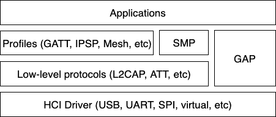
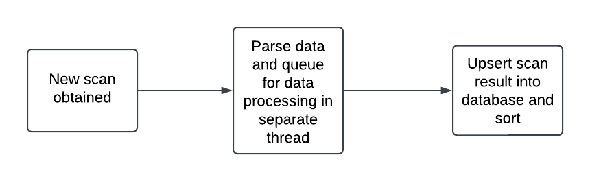
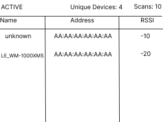

# Product Architecture

This product consists of several key components:
- The observation collection subsystem
- A CLI to interface with the device
- LCD screen to provide a simplistic GUI

These components work together to provide a device that meets the defined [requirements](software_requirements.md).

# The Observation Collection Subsystem
The observation collection system is responsible for several things:
- Controlling scan configuration
- Processing incoming scan results
- Provide an in-memory database for clients to retrieve and clear observations

## Scan Configuration
Bluetooth scanning in Zephyr is highly configurable with a stack that provides both low level
and high level interfaces. For this product, we will be focusing on the Generic Access Profile
(GAP) which provides a unified API across the low and high level parts of the Bluetooth stack.

*The following image was obtained from Zephyr's documentation on the [Bluetooth LE Host](https://docs.zephyrproject.org/3.7.0/connectivity/bluetooth/bluetooth-le-host.html).*

The GAP provides us ways to for our device to be connection or connection-less oriented.
We will be using a connection-less observer GAP.

This GAP configuration will give us the capability to scan for advertising packets around us
without having to send one back. This reduces power consumption as well as CPU usage.

At a high level, new advertising packets will be detected by the Bluetooth sensor which is then processed
in a callback. The callback will perform some data cleanup quickly and offload any data operations to
another thread.

### Passive vs Active Scanning
Passive scanning involves only listening for advertising packets without sending any scan requests. This
allows for lower power consumption and is faster. However, most passive scan packets do not include information
such as device name.

Active scanning will detect a advertising packet and then issue a scan request in return to obtain more
information. The scan request response packet will often times include information such as device name
or custom service information. It is up to the advertiser to choose to respond to the scan request so
it is not always a guarantee that more information will be obtained. The downside of this is that it
requires more power, increases discovery time, and potentially causes more interference which may be
in violation of regulatory compliance.

## Limitations of the STM52L475
The Bluetooth module on the STM52L475 device only supports Bluetooth 4.1. This means we are not able to utilize
the extended advertising packets feature of Bluetooth 5.0. The consequence of this is that we are severly limited
to what information and how much information we get at a given time. This results in us getting a lot of
"unknown" or "public" devices but no further information on who they are. This will be readily apparent during
device operation.

## In Memory Database
In order to store Bluetooth sensor readings, we will be using a singly linked list implementation. This
will allow for quick insertion and somewhat quick retrieval of sensor observations. One key invariant
of our implementation is that it must be sorted at all time. Specifically, we must ensure that
advertising packets with the strongest RSSI values appear first.

[RSSI (received signal strength indicator)](https://en.wikipedia.org/wiki/Received_signal_strength_indicator) values
are a simplified measurement of signal strength. RSSI values differ from chip manufacturers but our board
uses negative values. Universally, values closest to 0 represent the strongest signal strength.

Our simple in-memory database will also support variable retrieval from the front of the list as well as clearing
the list. In order to support a CLI based data retrieval, a client can pass in a number of observations they
want and that many strongest observations will be returned.

As detailed in the requirements, repeat devices should not count as "new" observations. Should a device
already exist in the database, its RSSI value must be updated with the new one. If it does not exist,
insert it into the database. This is referred to internally as an "upsert" operation.

It is important to note that this simple database is **NOT** thread safe. Careful consideration 
must be taken on the design of the list and its uses to ensure that memory is not corrupted.

This linked list will be implemented on the heap so there are memory considerations to be careful of
such as appropriate heap sizing.

## Process Flow of Incoming Scans to Storage in Database
New advertising packets are detected by the Bluetooth sensor. Zephyr will trigger a callback for each detected packet.
This callback will perform some simple data cleanup such as extracting the device name from the packet. This information
is then queued to be processed by a separate thread to be stored into the database.

# CLI Interface
The CLI interface is fairly simplistic, allowing for two main functionalities:
- Retrieving a user defined amount of observations and printing them to the terminal
- Clearing the in-memory database

## Data Retrieval
A simple command issued from the USART terminal will take a number
as an input and retrieve that many observations from the database. These observations are then
printed out to the terminal in a CSV format for viewing.

Should the provided number be greater than the current number of observations, the output will
only include up to the number of current observations. 0 or negative numbers will throw
an error to the terminal.

## Data Clearing
Since the in-memory database will be taking up heap space, it is important to provide
a way to clear the database so we do not run out of memory of the course of operation.
This should be done fairly quickly through a singular command.

# LCD Screen
The LCD screen will be responsible for providing a minimal UI. The UI is read only with no interaction from
the end user.

The screen should provide a status bar indicating the current scan mode, either active or passive. Additionally, there
should be simple metrics such as how many packets have been scanned and how many unique devices have been detected in
this status bar as well.

Below the status bar is the main content where the top 5 strongest Bluetooth devices detected will be listed. Each entry
should include the device address, the device name (or unknown/public if it was not advertised), and the RSSI value.
This simple low-fidelity wireframe of the UI provides an idea of what it will look like:

