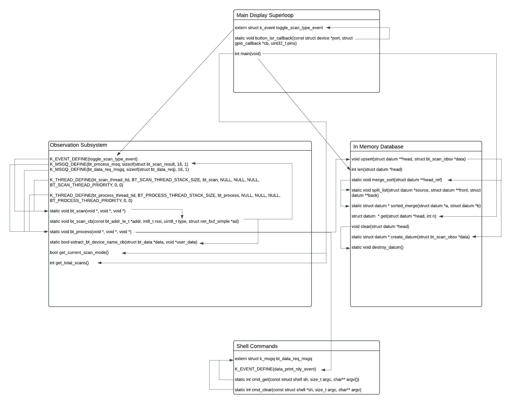
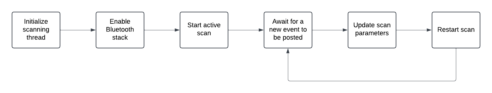
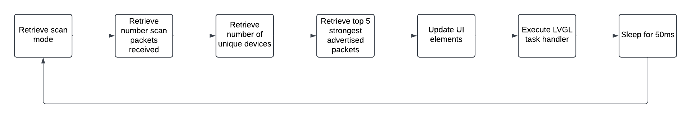

# System Interaction
The system composes of 4 main pieces:
- Observation collection
- Display
- CLI
- Database backed by a linked list

The central part is the observation collection subsystem which performs scans and processes them. It consists
of two threads: a scanning thread and a data processing thread.
The CLI and display subsystems interface with this observation collection subsystem to provide data to
the end user.

The following diagram provides a detailed view of different parts of the system and how they communicate:


There is a heavy use of asynchronous communication between all parts of the system. Notably, the use
of `k_event`s and `k_msgq`s allow for us to decouple different parts of the application so each part
only does one thing and does it well.

The shell commands all post to a message queue defined by:
```K_MSGQ_DEFINE(bt_data_req_msgq, sizeof(struct bt_data_req), 16, 1)```
whose only job is to process different data related operations such as inserting, retrieving,
or clearing data. This message queue is also used elsewhere through the application such as
the UI for retrieving data and the scanning thread to provide new scan observations that need
to be queued.

The data processing thread is responsible for being a single point of access to all data.
This is due to the fact that the the in-memory database is backed by a thread **unsafe** linked list.
This design could be improved through the use of a semaphore or a mutex but there was not enough time
to explore this. As such, all the list operations occur from a single thread, the data processing thread.
Given that the list is unsafe, there is quite a bit of bloat between consumers of data and the data itself.
Reliance on message queues and events provide a quick and easy solution but this design can most definitely
be improved.

The main display superloop communications with the observation subsystem using a `k_event` and
a `k_msgq`. The `k_event` provides a lightweight way for us to notify that processing thread
that the scan type needs to be updated. The `k_msg` is used to queue up data operations
for reading observations.

# Observation Collection
Zephyr provides a robust Bluetooth stack with support for Bluetooth 4.1. For the operation
of our device, we will be utilizing the observer GAP profile which is a low-energy,
connection-less Bluetooth role. 

## Scanning
Scanning and processing scans are each done in their own thread. This will allow for data operations
to not be blocked and ensure that the LCD screen is up to date.

### Configuration
At thread startup, the Bluetooth stack is enabled via `bt_enable()`. Once that is successful,
configuration for scanning is simply done by definining a `struct bt_le_scan_param` and
assigning each member of the struct the appropriate value.

The `type` value of the scan parameters indicates why type of scanning to do. The system starts
with that value set to `BT_LE_SCAN_TYPE_ACTIVE` and is then toggled via a user action button
as described below. A `k_event` is configured and awaited indefinitely during thread operation.
When a new event is received, the scan type is toggled between active or passive.
Then, scanning is restarted to load in the new configuration.

In order to enable events, the following Kconfig option must be defined:
```
CONFIG_EVENTS=y
```

The `interval` and `window` values of the scan parameters describe how often and how big of window
to collect scans for. To limit CPU usage, the interval is set to `BT_GAP_SCAN_SLOW_INTERVAL_2`
which indicates to scan every 2.56 seconds. The window is set to `BT_GAP_SCAN_FAST_WINDOW`
meaning that that the window is 30ms large.

The final member of the scan parameters is the `option` field which we have set to
`BT_LE_SCAN_OPT_FILTER_DUPLICATE` to filter out duplicates.

### Scan Processing

When new scans are received, a callback is ran that extracts the device name from the
packet, if present, and posts a message to a message queue defined statically by
`K_MSGQ_DEFINE(bt_process_msgq, sizeof(struct bt_scan_result), 16, 1)`. This message
queue is processed by a separate data processing thread described below to process
observations and load them into the database.
 
### Button Configuration
The user action button is configured on GPIO port C pin 13 in a active low configuration. We can register
this with an ISR in the main thread. On a button press, a simple event is sent using Zephyr events via
`k_event_set` which is read by this scanning thread.

### Process Flow
The scan initialization and configuration is described by the following process flow:



## Data Processing
Data processing occurs in its own thread. The data processing waits on the message queue mentioned above
defined as `K_MSGQ_DEFINE(bt_process_msgq, sizeof(struct bt_scan_result), 16, 1)`. When a new message
is received, an upsert operation is executed to load the data into the in-memory database backed by a
singly linked list.

A second message queue is responsible for receiving new data requests such as reading and clearing data.
It is important to note that data insertion will always occur before and retrieval or deletion operation.
In the following sequence of events:
1. Shell command issued to clear data
2. Scan processing request is queued

the scan processing request will always be handled first and then the data operation. This is intentional
as depending on how scanning is configured, the number of scans and the velocity they arrive at can be very
high. Data operations may take a while depending on the size of the list so it is important that the message
queue does not get too full with new scan processing requests while data operations are going on.

It is important to note that polling for both the event and the message queue in this thread should be done
without waiting. If a message or event is not available, the thread execution should continue without waiting.
This ensures that one particular operation does not have to wait too long just because another event
or message has not been received.

Data requests come in through a `struct bt_data_req`. `bluetooth.h` defines the following constants that control
what type of data operation will happen:
- `BT_DATA_REQ_CLEAR`
- `BT_DATA_REQ_GET`
- `BT_DATA_REQ_PRINT`

Depending on what type of request is given, only some members of the struct need to be defined.
For `BT_DATA_REQ_CLEAR`, no other struct members need to be defined as no data is being returned.

For `BT_DATA_REQ_GET` and `BT_DATA_REQ_PRINT`, `bt_data_req.result_list` must be a valid pointer
for the type `struct datum`. It is required that this pointer points to memory allocated
on the heap as the data processing thread is dereference it and place a node that that holds data
for the output of a get query. `bt_data_req.get_count` must also be defined with the number of
observations to retrieve.

`BT_DATA_REQ_GET` and `BT_DATA_REQ_PRINT` are two separate requests types as the latter one will post
to a `k_event` to notify that data is ready to be printed. The `BT_DATA_REQ_PRINT` request type
is intended only to be used the CLI. Use of the `k_event` is detailed [below](#cli).

### Linked List and Upserts
A very basic linked list is defined in `bt_db.h` and `bt_db.c`. The nodes on the linked list are
defined on the default system heap whose size is configured via the follwoing Kconfig option:
```
CONFIG_HEAP_MEM_POOL_SIZE=4096
```

The linked list has an invariant mandating that it is sorted by the RSSI value of each Bluetooth scan
observation. To achieve this, we use a merge sort operation which recursively sorts the list. The
choice of a merge sort was driven by needing to sort quickly at the expense of CPU cycles. Since we do
not have a computationally expensive system, we can afford the hit on CPU computations.

Each node in the linked list is defined by `struct datum` which contains a pointer to a scan
observation and a pointer to the next element in the list.

The primary use of the linked list to support an upsert operation wherein packets that are for devices
not already in the data structure are appended. Packets that are for devices in the data stucture instead
trigger and upate of the existing node. This helps avoid duplicate entries and keep the memory footprint low.

#### Supported Functionality
The public API of the linked list supports the following operations:
```C
/**
 * bt_db represents an internal database backed by a singly linked
 * list. Each node represents a particular reading from a Bluetooth advertising
 * packet. 
 * 
 * The database is sorted by RSSI values, with lowest appearing at the start of the
 * list. Lower RSSI values correlate to higher signal strength.
 */

struct datum {
    struct bt_scan_obsv *data;
    struct datum *next;
};


/**
 * @brief Returns the length of the list
 */
int len(struct datum *head);

/**
 * @brief Upserts a new datum node into the list. If the device does not
 * exist in the list, it is added to the list. If it does exist, its
 * RSSI value is updated. Devices are uniquely identified by their address.
 * 
 * The list is sorted after every upsert operation to ensure observations with
 * the lowest RSSI values are at the front.
 * 
 * @param head Reference to the head of the list
 * @param data Data to be included in the node.
 */
void upsert(struct datum **head, struct bt_scan_obsv *data);

/**
 * @brief Retrieves upto a certain number of nodes from the list. If the
 * requested number exceeds the length of the list, only the number of nodes
 * match the length are returned.
 * 
 * @param head Reference to the start of the list
 * @param n Number of elements requested
 * 
 * @return A reference to a new list node. This new list is separate from the list,
 * holding no reference to entire list. This is to avoid accidental data manipulation.
 */
struct datum * get(struct datum *head, int n);

/**
 * @brief Clears all data stored in the in-memory database list.
 * 
 * @param head Pointer to a pointer to start of the list
 */
void clear(struct datum **head);
```

The two important functions are `void upsert(struct datum **head, struct bt_scan_obsv *data)`
and `struct datum * get(struct datum *head, int n)`.

The `upsert` operation will insert new nodes if they do not exist in the list already. If a node does exist,
its RSSI value is updated instead of adding a new node. The predicate for checking if a node exists
is simply comparing device addresses since those should be sufficiently unique. Each upsert operation
triggers a sort operation as well. Sorting is performed by a merge sort algorithm which allows us quickly
sort the list at the cost of CPU computation. Since our application is fairly small, we can afford this
hit on CPU cycles.

The list is sorted by RSSI values, with the strongest values being at the start of the list. With our
Bluetooth module, the closer a number is to 0, the stronger the signal is. 

The `get` operation will retrieve a certain number of observations from the database. This is useful
both for the LCD display and the USART terminal which will issue a command to retrieve a certain number
of observations. If the provided value exceeds the number of observations in the database, then all
of the observations are returned. If a value is `<= 0`, then `NULL` pointer is returned instead.

For the get operation, the pointer returned points to a new list that is a copy from the database. This is
important to avoid a client accidentally modifying any data or breaking internal tracking.

# LCD Display
The LCD display provides a readonly, no interaction, view of the current system state. The following
data points are displayed on the screen:
- Current scan mode
- Number of packets scanned
- Number of unique packets scanned
- 5 strongest packets scanned

The main thread is responsible for retrieving data and displaying it on the LCD screen. Current scan mode
is obtained via the `bool get_current_scan_mode()` function defined in `bluetooth.h`. A value of
`true` indicates that the current scan mode is active and `false` indicates passive. This value is then
displayed on the status bar at the top of the screen.

Observations are obtained through the `struct datum * get(struct datum *head, int n)` with `n` set to
a value of 5. These observations are then displayed below the status bar as rows in a table. Since
the in-memory database is sorted, the observations we receive will be the `n` strongest scan
packets.

After all data is collected, the state of the LCD screen is updated and then the thread waits for
10ms before refreshing. This will allow for us to meet the minimum update latency of 500ms described
in the [requirements](software_requirements) document.

## Process Flow Diagram
The following diagram details the superloop behavior of the main thread:



# CLI
The CLI will provide two commands part of a command set:
- `database get {n}`
- `database clear`

All commands are issued via USART terminal

## `database get {n}`
Retrieves `n` observations from the database. Will return an error if a value `< 1` is provided. This
command will output the collected observations in a CSV format to the terminal for easy viewing.

## `database clear`
The `database clear` command will wipe the contents of the in-memory database as well as any tracked metrics
such as total scans and unique devices.

## Architecture
For communication between threads, the CLI subsystem relies on a `k_msgq` and a `k_event`. The message queue
is used for passing data requests to the observaton subsystem and
is described in [Data Processing](#data-processing).

There is a `k_event` called `data_print_rdy_event`. This is used by the data processing thread
to notify the CLI when data is ready to be printed out to the terminal. When the CLI
submits a `BT_DATA_REQ_PRINT` request, the data is obtained from the database and then the
data processing thread will alert by posting to the event. This allows for asynchronous
communication and the use of `K_FOREVER` ensures that these operations are not blocking while
they are waiting for data.

Once an event is posted to `data_print_rdy_event`, the scan results are then printed out to the
terminal through the use of `shell_print()`.